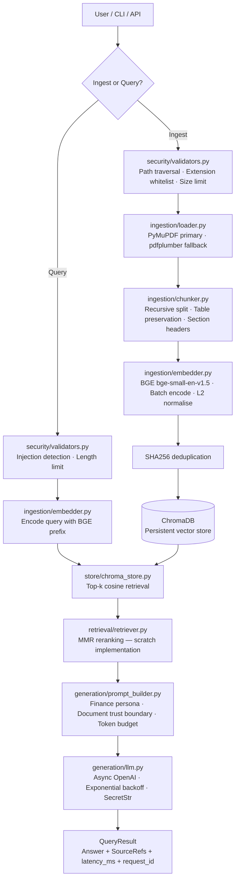

# FinRAG — Finance-Domain RAG System


> **A standalone, production-quality RAG system built as a companion project to [SSB (Smart Strategies Builder)](https://smartstrategiesbuilder.ai).**

SSB handles market data, stock analysis, and ML-driven insights. FinRAG explores the document-grounded intelligence layer — earnings reports, 10-K filings, and SEC documents — that a financial platform's AI assistant could eventually leverage. The two projects are not yet integrated; FinRAG is built alongside SSB to demonstrate how document-grounded Q&A could extend SSB's analytical capabilities.

---

## Overview

FinRAG ingests financial documents (PDFs, TXT, Markdown), chunks and embeds them using BGE embeddings, stores vectors in ChromaDB, and answers questions via retrieval-augmented generation with GPT-4o-mini. The system is designed with production concerns in mind: security-first input validation, rate limiting, structured logging, and a clean abstract interface that enables swapping ChromaDB for pgvector without touching business logic.

**What it handles:**
- SEC 10-K and 10-Q annual/quarterly filings
- Earnings call transcripts (text format)
- Financial news articles
- Corporate press releases and MD&A sections

**Known limitations:**
- Image-only (scanned) PDFs require OCR preprocessing (not included)
- Complex multi-page tables may be split at page boundaries
- Real-time data is out of scope — this is a document-grounded system

---

## Architecture



---

## Security

Security is architectural, not an afterthought — `security/validators.py` is committed **second** in the commit history, immediately after repo initialisation.

| Layer | Implementation |
|---|---|
| **Secrets management** | All keys via `.env` only; `pydantic SecretStr` prevents logging |
| **Path traversal** | `validate_file_path()` rejects `..` sequences before any file I/O |
| **Extension whitelist** | Only `.pdf`, `.txt`, `.md` accepted |
| **File size limit** | Configurable via `MAX_FILE_SIZE_BYTES` (default 50 MB) |
| **Prompt injection defence** | System prompt trust boundary + 10 regex patterns logged and rejected |
| **Rate limiting** | `slowapi` per-IP limits on `/ingest` and `/query` |
| **CORS** | Restrictive by default — `localhost` only, configurable for prod |
| **Health endpoint** | Returns only `status` + `doc_count` — no internal paths or versions |
| **Error responses** | Generic messages to client; full details in structured logs with `request_id` |
| **Container** | Non-root `finrag` user; no `--privileged`; secrets via env_file |
| **Dependencies** | All versions pinned; `pip-audit` in test suite |

---

## Quick Start

```bash
# 1. Clone
git clone https://github.com/DowellHd/finrag.git && cd finrag

# 2. Create virtual environment
python -m venv .venv && source .venv/bin/activate

# 3. Install dependencies
pip install -r requirements.txt

# 4. Configure secrets
cp .env.example .env
# Edit .env — add your OPENAI_API_KEY

# 5. Ingest a sample 10-K excerpt (bundled)
python -m finrag ingest data/sample/AAPL_10K_2023_excerpt.txt --ticker AAPL --doc-type 10-K

# 6. Ask a question
python -m finrag query "What were Apple's main risk factors in 2023?"

# 7. (Optional) Download and ingest a full EDGAR filing
python scripts/ingest_sec_filing.py
```

### Start the API server

```bash
uvicorn api.main:app --host 0.0.0.0 --port 8000 --reload
# Swagger UI: http://localhost:8000/docs
```

### Docker

```bash
docker build -f docker/Dockerfile -t finrag:latest .
docker run --env-file .env -p 8000:8000 finrag:latest
```

---

## API Reference

### `POST /ingest`

Ingest a financial document into the vector store.

```json
// Request
{
  "file_path": "/data/sample/AAPL_10K_2023.pdf",
  "ticker": "AAPL",
  "doc_type": "10-K"
}

// Response
{
  "source_file": "AAPL_10K_2023.pdf",
  "chunks_stored": 142,
  "chunks_skipped": 0,
  "total_chunks": 142,
  "request_id": "a3f2b1c9"
}
```

### `POST /query`

Ask a financial question grounded in ingested documents.

```json
// Request
{
  "question": "What were Apple's main risk factors in fiscal 2023?",
  "top_k": 5
}

// Response
{
  "answer": "Apple identified several key risk factors in fiscal 2023...",
  "sources": [
    {"source_file": "AAPL_10K_2023.pdf", "page_num": 12, "ticker": "AAPL", "doc_type": "10-K"}
  ],
  "latency_ms": 1243.7,
  "request_id": "b7d9e2a1"
}
```

### `GET /health`

```json
{"status": "ok", "doc_count": 142}
```

---

## Design Decisions

### Why BGE over MiniLM?
`BAAI/bge-small-en-v1.5` outperforms `all-MiniLM-L6-v2` on BEIR financial retrieval benchmarks. BGE also supports a query prefix (`Represent this sentence for searching relevant passages:`) that further improves asymmetric search quality. The performance difference is meaningful on domain-specific financial terminology.

### Why ChromaDB?
Local-first persistent storage with no infrastructure overhead for development. The `AbstractVectorStore` interface means switching to pgvector (for production PostgreSQL deployments) requires only a new adapter class — no changes to retrieval or pipeline code.

### Why MMR reranking?
Financial documents frequently repeat the same figures across MD&A, financial statements, and footnotes. Naive cosine top-k returns redundant chunks. MMR (Maximal Marginal Relevance) balances relevance and diversity, ensuring the LLM receives a broader context window. Implemented from scratch using NumPy — no LangChain dependency.

### Why no LangChain?
FinRAG demonstrates RAG depth by implementing chunking, MMR, and retrieval from scratch. This reduces the attack surface (fewer transitive dependencies), avoids LangChain's frequent breaking changes, and produces code that is fully auditable. It also makes for a stronger portfolio signal: every component is understood and owned.

---

## Testing

```bash
# Run all tests
pytest tests/ -v

# Check for known CVEs in dependencies
pip-audit -r requirements.txt

# Skip heavy integration tests (e.g. CI without GPU)
FINRAG_SKIP_INTEGRATION=1 pytest tests/ -v
```

Test coverage:
- `test_validators.py` — path traversal, extension whitelist, size limits, 10 injection patterns
- `test_chunker.py` — overlap math, sentence boundary preservation, table detection
- `test_retriever.py` — MMR diversity vs naive top-k, cosine properties, edge cases
- `test_pipeline.py` — end-to-end ingest → query → source citation (real BGE, fake LLM)

---

## Future Integration with SSB

FinRAG is architected so its retrieval layer can plug into SSB's market analysis assistant as a document-grounded context provider. Concretely:

- SSB's assistant could call FinRAG's `/query` endpoint to retrieve relevant 10-K passages before generating a market insight
- FinRAG's `AbstractVectorStore` interface supports a pgvector backend that would integrate naturally with SSB's existing PostgreSQL infrastructure
- The `SourceRef` response model maps directly to citation cards that SSB's UI could render alongside analysis

This represents a potential future extension, not a current integration. The two systems are maintained separately while the architecture deliberately avoids coupling.

---

## Roadmap

- [ ] **pgvector adapter** — `AbstractVectorStore` implementation for PostgreSQL/pgvector production deployments
- [ ] **Hybrid BM25 + dense retrieval** — sparse + dense fusion for improved recall on exact financial figures
- [ ] **Streaming responses** — async streaming from OpenAI for lower perceived latency on long answers
- [ ] **RAGAS evaluation** — automated faithfulness, answer relevancy, and context precision scoring
- [ ] **Auth layer** — API key authentication for multi-tenant deployments
- [ ] **OCR pipeline** — Tesseract integration for scanned PDF support
- [ ] **Async ingest** — background task queue for large document batches

---

## Project Structure

```
finrag/
├── config/settings.py           # pydantic-settings; SecretStr for API keys
├── security/validators.py       # Path traversal · extension whitelist · injection detection
├── ingestion/
│   ├── loader.py                # PyMuPDF + pdfplumber fallback; filename metadata parsing
│   ├── chunker.py               # Recursive splitter; finance-aware; table preservation
│   └── embedder.py              # BGE wrapper; batch encode; L2 normalise; device auto-detect
├── store/
│   ├── base.py                  # AbstractVectorStore interface
│   └── chroma_store.py          # ChromaDB implementation
├── retrieval/retriever.py       # MMR from scratch; Retriever class
├── generation/
│   ├── prompt_builder.py        # Finance persona; trust boundary; token budget
│   └── llm.py                   # Async OpenAI; retry; SecretStr
├── pipeline/rag_pipeline.py     # Ingest + Query orchestration; SHA256 dedup
├── api/main.py                  # FastAPI; rate limiting; strict Pydantic models
├── cli/run.py                   # python -m finrag ingest / query
├── tests/                       # pytest; real embeddings; no LLM API calls
├── data/sample/                 # Public-domain EDGAR excerpt for demo
├── scripts/ingest_sec_filing.py # Download + ingest EDGAR 10-K
└── docker/Dockerfile            # Multi-stage; non-root user
```

---

## License

MIT — see [LICENSE](LICENSE).

---

*FinRAG is a standalone portfolio project. It is not currently integrated with or dependent on SSB (Smart Strategies Builder). The two projects are built alongside each other to explore a complementary financial intelligence architecture.*
